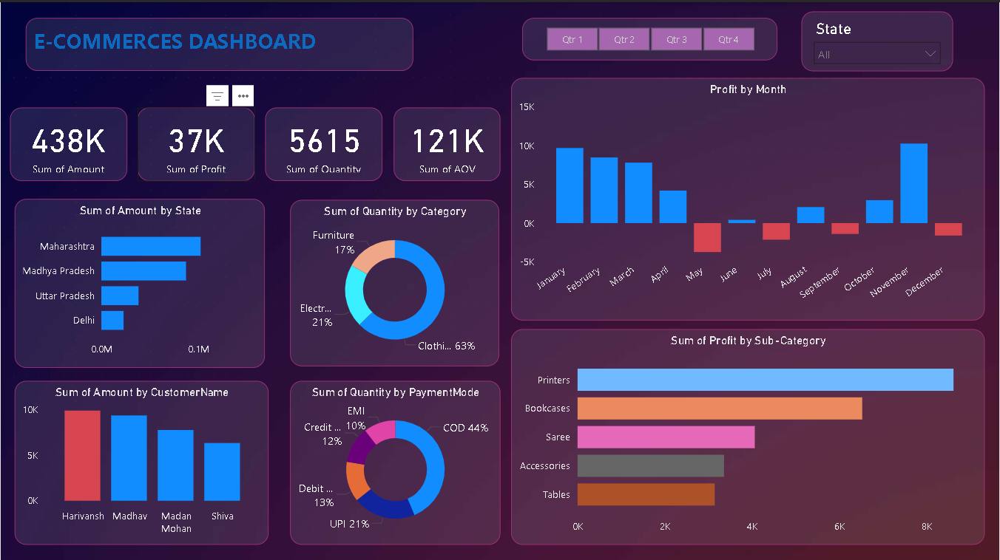

 <h1>📊E-Commerce Sales Performance Analysis KPI Dashboard </h1> 
<b> Power BI Dashboard</b>
 
     <h3>Developed By</h3> <h2><b>Ayuresh Anil Fendar</b></h2> <h4>📌 Data Analyst | Analytics | KPI Dashboard </h4>  

## 📊 Project Overview

This project is a Power BI dashboard that analyzes sales performance, revenue trends, and key business metrics.

## 🔧 Tools Used

* Power BI
* SQL
* Excel

## 📌 Key Features

* KPI tracking (Revenue, Profit, Sales)
* Interactive filters and slicers
* Monthly and category-wise analysis
* Data cleaning and transformation

## 📷 Dashboard Preview

## 📁 Dataset

The dataset used in this project is included in the repository.

## 🚀 Insights

* Identified top-performing regions and products
* Analyzed sales trends over time

